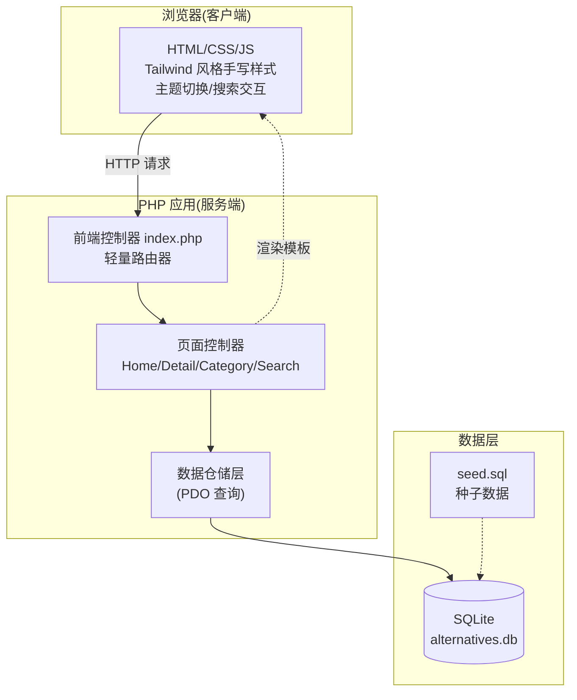
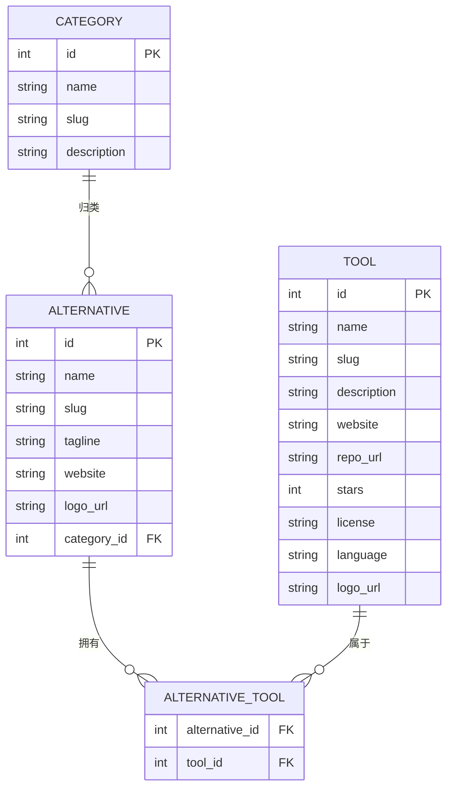

# 技术架构文档 — 开源软件替代品目录 (PHP)

> 说明：用户明确要求后端语言为 PHP。前端技术栈自由选择。本方案采用 **PHP 8 + SQLite + 手写 CSS/JS**，无需 Node 构建步骤，开箱即用。

## 1. 架构设计



## 2. 技术说明
- **后端**：PHP 8+（原生，无框架），使用内置 PHP 内置服务器 `php -S` 即可运行。
- **数据库**：SQLite（PDO 驱动，文件型，零配置），随附 `seed.sql` 初始化数据。
- **前端**：手写 CSS（CSS 变量主题系统）+ 原生 JS（搜索、主题切换、字母锚点）。字体走 Google Fonts CDN。
- **无构建步骤**：无需 npm/Node，纯静态资源 + PHP 模板。

## 3. 路由定义
| 路由 | 控制器 | 用途 |
|------|--------|------|
| `/` | HomeController | 首页：Hero + 目录 + 分类 |
| `/category/{slug}` | CategoryController | 分类下的商业软件列表 |
| `/search?q=` | SearchController | 搜索结果 |
| `/tool/{slug}` | ToolController | 单个开源工具详情 |
| `/about` | AboutController | 关于页 |
| `/{slug}` | DetailController | 商业软件的开源替代详情页 |
| `/api/search?q=` | SearchApi | 搜索 JSON 接口（可选） |

## 4. 目录结构
```
tool-nav/
├── public/                # Web 根目录
│   ├── index.php          # 前端控制器 + 路由
│   ├── assets/
│   │   ├── css/style.css
│   │   ├── js/app.js
│   │   └── img/           # 占位/logo
├── app/
│   ├── bootstrap.php      # DB 连接 + 公共函数
│   ├── controllers/       # 各页面控制器
│   ├── repositories/      # 数据查询
│   └── views/             # 模板 (layout + partials)
├── database/
│   ├── schema.sql         # 建表
│   └── seed.sql           # 种子数据
├── .trae/documents/       # 本文档
```

## 5. 数据模型

### 5.1 实体关系


### 5.2 数据定义语言 (DDL 摘要)
- `categories(id, name, slug, description)`
- `alternatives(id, name, slug, tagline, description, website, logo_url, category_id, created_at)`
- `tools(id, name, slug, description, website, repo_url, stars, license, language, logo_url, created_at)`
- `alternative_tool(alternative_id, tool_id, PRIMARY KEY(alternative_id, tool_id))`

种子数据覆盖约 40+ 商业软件与 60+ 开源工具，跨多个分类（笔记、设计、开发、通信、存储等），确保首页目录与详情页内容饱满。
