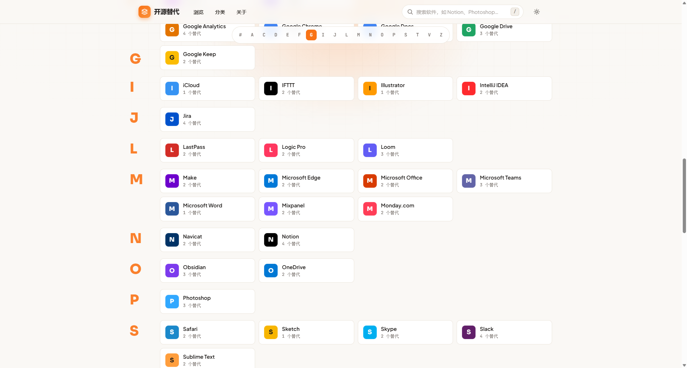
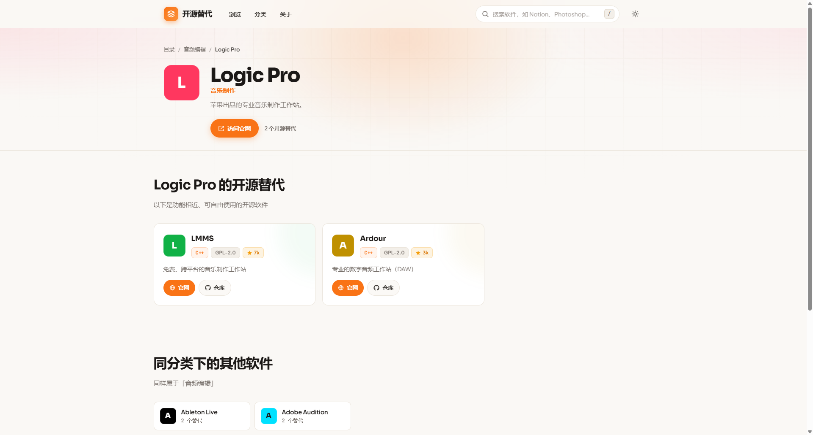

# 松子开源导航 (Songzee OpenNav)

> 发现商业软件的开源替代品 —— 一个简洁优雅的开源软件目录网站


**演示地址**：[opennav.songzee.com.cn](//opennav.songzee.com.cn/)

## 项目简介

Songzee OpenNav 是一个开源软件替代品目录网站，帮助开发者和用户发现闭源软件的免费开源替代方案。

**主要功能**：
- 浏览商业软件列表（按字母索引）
- 查看每个商业软件的开源替代方案
- 按分类筛选（笔记、设计、开发工具、通讯等）
- 搜索功能
- 明暗主题切换

**数据规模**：收录 54+ 商业软件、66+ 开源工具、15 个分类

## 界面预览





## 快速开始

### 方式一：一键安装（推荐）

1. 下载项目源码并解压到网站根目录
2. 在浏览器访问 `http://your-domain/install.php`
3. 按照安装向导完成配置

### 方式二：手动安装

#### 环境要求
- PHP 8.0+
- MySQL 5.7+ 或 MariaDB 10.2+
- Apache（推荐）或 Nginx

#### 步骤

1. **配置数据库**

创建数据库和用户：
```sql
CREATE DATABASE your_db_name CHARACTER SET utf8mb4 COLLATE utf8mb4_unicode_ci;
CREATE USER 'your_db_user'@'localhost' IDENTIFIED BY 'your_db_pass';
GRANT ALL PRIVILEGES ON your_db_name.* TO 'your_db_user'@'localhost';
FLUSH PRIVILEGES;
```

2. **配置站点**

复制并修改配置文件：
```bash
cp config/config.php.example config/config.php
```

编辑 `config/config.php`：
```php
return [
    'db' => [
        'host'    => '127.0.0.1',
        'name'    => 'your_db_name',
        'user'    => 'your_db_user',
        'pass'    => 'your_db_pass',
        'charset' => 'utf8mb4',
    ],
    'site' => [
        'name'    => '松子开源导航',
        'tagline' => '发现商业软件的开源替代品',
        'url'     => '/',
        'assets'  => '/assets',
    ],
];
```

3. **导入数据**

```bash
php import.php
```

4. **配置 Web 服务器**

**Apache**：确保 `.htaccess` 生效，启用 `mod_rewrite`

**Nginx**：添加如下配置到 server 块：
```nginx
location / {
    try_files $uri $uri/ /index.php?$query_string;
}
```

5. **访问站点**

打开浏览器访问你的域名即可。

## 技术栈

| 组件 | 技术 | 说明 |
|------|------|------|
| 后端 | PHP 8+ | 原生代码，无需框架 |
| 数据库 | MySQL/MariaDB | PDO 连接 |
| 前端 | 原生 HTML/CSS/JS | 零构建步骤 |
| 样式 | CSS3 | 自定义主题系统 |
| 字体 | Google Fonts | Sora / Plus Jakarta Sans |

## 项目结构

```
.
├── index.php              # 前端控制器（单一入口）
├── install.php            # 一键安装向导
├── import.php             # 数据导入脚本
├── .htaccess              # Apache 重写规则
├── config/
│   └── config.php         # 应用配置
├── app/
│   ├── bootstrap.php      # 引导文件（DB连接、辅助函数）
│   ├── Router.php         # 路由器
│   ├── View.php           # 视图渲染
│   ├── Controllers.php    # 页面控制器
│   └── repositories/
│       └── Repositories.php # 数据访问层
├── app/views/             # 页面模板
│   ├── layout.php         # 布局模板
│   ├── home.php           # 首页
│   ├── detail.php         # 商业软件详情
│   ├── category.php       # 分类页
│   ├── tool.php           # 工具详情
│   ├── search.php         # 搜索页
│   ├── about.php          # 关于页
│   ├── 404.php            # 404页面
│   └── partials/          # 组件模板
├── assets/
│   ├── css/style.css      # 样式文件
│   └── js/app.js          # 交互脚本
└── database/
    ├── schema.sql         # 数据库结构
    └── seed.sql           # 种子数据
```

## 路由说明

| 路由 | 说明 |
|------|------|
| `/` | 首页（软件目录） |
| `/{slug}` | 商业软件详情页 |
| `/category/{slug}` | 分类页 |
| `/tool/{slug}` | 开源工具详情页 |
| `/search?q=xxx` | 搜索页 |
| `/about` | 关于页 |

## 开发

### 本地开发服务器

```bash
php -S localhost:8080 index.php
```

访问 `http://localhost:8080`

### 添加新数据

1. **添加商业软件**：编辑 `database/seed.sql`，在 `alternatives` 表插入记录
2. **添加开源工具**：编辑 `database/seed.sql`，在 `tools` 表插入记录
3. **建立映射关系**：在 `alternative_tool` 表添加关联

执行 `php import.php` 重新导入数据。

## 贡献指南

欢迎提交 Issue 和 Pull Request！

1. Fork 本仓库
2. 创建特性分支 `git checkout -b feature/xxx`
3. 提交修改 `git commit -m 'Add xxx'`
4. 推送到分支 `git push origin feature/xxx`
5. 发起 Pull Request

## 许可证

MIT License - 详见 [LICENSE](LICENSE) 文件

## 致谢

本项目灵感来源于 [openalternative.co](https://openalternative.co)，感谢原作者的创意和开源精神。
